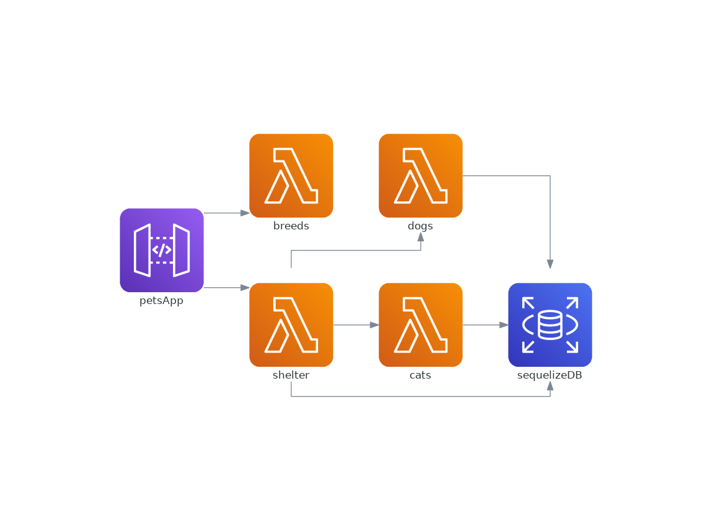

# TS Pets App
The app demonstrates a sample application that is instrumented with Klotho annotations to transform and generate IaC to be run in the cloud.

## Terraform
Included in this repo at (terraform/generated)[./terraform/generated] are terraform files representing this same infrastructure (generated by [terraformer](https://github.com/GoogleCloudPlatform/terraformer) then manually adjusted).
